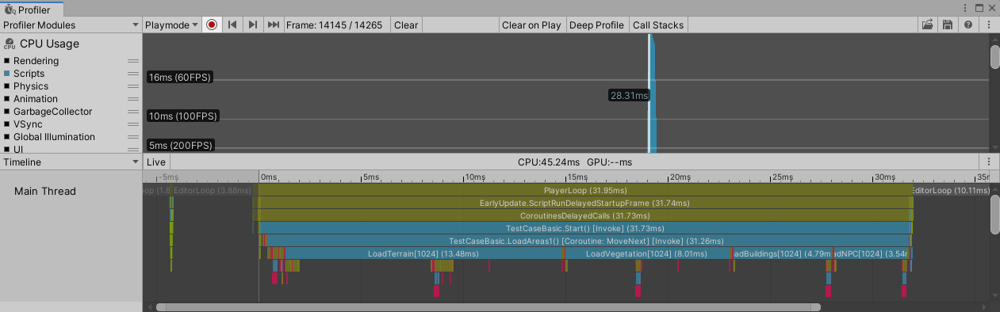
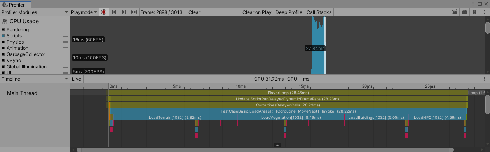
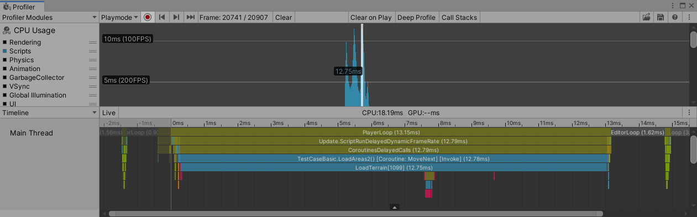
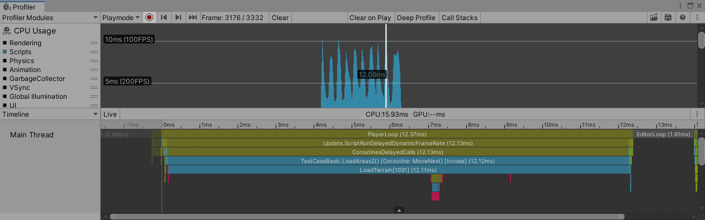
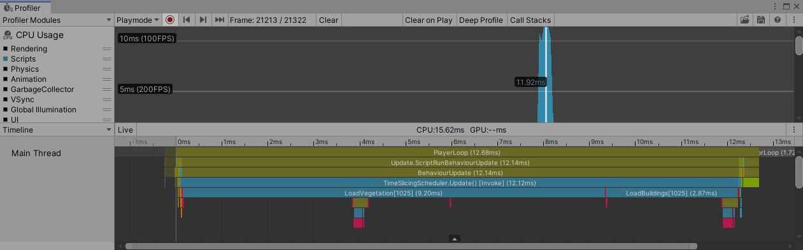
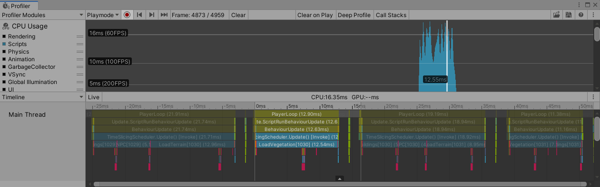

## Easy Time Slicing

EasyTimeSlicing makes it easy to slice heavy tasks into consequent game frames to execute and helps to keep the game running smoothly and avoid janks or spikes.

## Why time slicing

There are often problems that have to execute a large number of tasks in a short period (like in a few frames), which, if not handled properly, can cause junk and reduce the performance of the game.

Here's a common scenario that is to load some areas, including terrain, vegetation, buildings, and NPCs. We will test with two cases, first loading 3 areas and then 10 areas.

Now we have the following codes:

```C#
public IEnumerator LoadAreas1(List<int> requestedAera)
{
    foreach (var area in requestedAera)
    {
        AreaInfo info = GetAreaInfo(area);
        LoadTerrain(info);
        LoadVegetation(info);
        LoadBuildings(info);
        LoadNPC(info);
        yield return null;
    }
}
```

Job completed in a few frames, and the profiler shows like this, junk and spikes are obvious:





(The top image is for 3 aeras, and the bottom is for 10 areas)

Now we try to spread the task over more frames:

```C#
public IEnumerator LoadAreas2(List<int> requestedAera)
{
    foreach (var area in requestedAera)
    {
        AreaInfo info = GetAreaInfo(area);
        LoadTerrain(info);
        yield return null;
        LoadVegetation(info);
        yield return null;
        LoadBuildings(info);
        yield return null;
        LoadNPC(info);
        yield return null;
    }
}
```

Now it's getting smooth, but the time per frame may be underused:





(The top image is for 3 aeras, and the bottom is for 10 areas)

Here comes your new choice, EasyTimeSlicing makes it easier to slice a task into separate frames and also make the most of those frames.

```C#
public SliceableTask LoadAreas3(List<int> requestedAera)
{
    List<Action> tasks = new List<Action>();
    foreach (var area in requestedAera)
    {
        AreaInfo info = GetAreaInfo(area);
        tasks.Add(() => LoadTerrain(info));
        tasks.Add(() => LoadVegetation(info));
        tasks.Add(() => LoadBuildings(info));
        tasks.Add(() => LoadNPC(info));
    }

    return new SliceableTask(0.010f, tasks);
}
```

And the diagram:





(The top image is for 3 aeras, and the bottom is for 10 areas)

There are no big spikes, and the time per frame is better utilized.

The following chart is a summary that compares the three solutions in each cases:

|            | frame count (3 areas) | longest frame (3 areas) | frame count (10 areas) | longest frame (10 areas) |
| ---------- | --------------------- | ----------------------- | ---------------------- | ------------------------ |
| LoadAreas1 | 3                     | 23.81ms (42FPS)         | 10                     | 27.84ms (36FPS)          |
| LoadAreas2 | 12                    | 12.75ms (78FPS)         | 40                     | 12.06ms (83FPS)          |
| LoadAreas3 | 7                     | 11.92ms (84FPS)         | 21                     | 12.55ms (80FPS)          |

Another practical application is to reduce the junk caused by object instantiation, by spreading the instantiating tasks over multiple frames while limiting the maximum execution time in one frame.

```c#
private void RunInstantiateTask()
{
    // omitted code...
    new SliceableTask(executionTime, InstantiateItem2);
}

private IEnumerator InstantiateItem2()
{
    // omitted code...
    int index = 0;

    while (index < total)
    {
        if (index < 0 || index >= total)
        {
            yield break;
        }

        // omitted code...
        GameObject go = Instantiate(prefab, this.transform);

        index++;

        yield return null;
    }
}
```


## Installation

Clone this repository and copy it to your project folder, or add `https://github.com/aillieo/EasyTimeSlicing.git#upm` as a dependency in the Package Manager window.

## Quick Start

There are two ways to slice tasks: creating a single `SliceableTask` at once or adding tasks to a `SliceableTaskQueue`. Assume that you have functions named `Action0`, `Action1`, `Action2`..., and that's what you are trying to execute in several frames.

### Use single SliceableTask

There are 4 methods to create a `SliceableTask`, use the constructor with different arguments. The max time for execution must be given. And the task will start to execute once constructed.

1. create with array or list of `Action`:

```c#
SliceableTask task1 = new SliceableTask(0.01f, Action0, Action1, Action2);

// or
SliceableTask task2 = new SliceableTask(0.01f, new List<Action>
{
    Action0,
    Action1,
    Action2
});
```

2. with a state machine function:

```c#
private bool StateMachineFunc(ref int state)
{
    switch (state)
    {
        case 0:
            Action0();
            state++;
            return false;
        case 1:
            Action1();
            state++;
            return false;
        case 2:
            Action2();
            state++;
            return true;
    }

    throw new Exception($"invalid state {state}");
}

// then use it:
SliceableTask task = new SliceableTask(0.01f, 0, StateMachineFunc);
```

3. with another form of state machine function:

```c#
private int state = 0;
private bool StateMachineFunc()
{
    switch (state)
    {
        case 0:
            Action0();
            state++;
            return false;
        case 1:
            Action1();
            state++;
            return false;
        case 2:
            Action2();
            state++;
            return true;
    }

    throw new Exception($"invalid state {state}");
}

// then use it:
SliceableTask task = new SliceableTask(0.01f, StateMachineFunc);
```

4. with a function containing enumerable logic:

```c#
private IEnumerator EnumFunc()
{
    Action0();
    yield return null;
    Action1();
    yield return null;
    Action2();
    yield return null;
}

// then use it:
SliceableTask task = new SliceableTask(0.01f, EnumFunc);
```

When trying to cancel a task:

```c#
// SliceableTask task = ...
task.Cancel();
```

### Use SliceableTaskQueue

You can create a `SliceableTaskQueue` and add actions to it continuously.

```c#
SliceableTaskQueue queue = new SliceableTaskQueue(0.003f);
```

Once you have a `SliceableTaskQueue`, you can add tasks and queue them up simply with desired priority.

```c#
// SliceableTask task1 = ...
queue.Enqueue(task1, SliceableTaskQueue.Priority.High);

// or 
// SliceableTask task2 = ...
var handle = queue.EnqueueWithHandle(task2, SliceableTaskQueue.Priority.High);
```

With a `Handle`, you can cancel a queued task when necessary. A queued task can be canceled only if it is not executed yet.

```c#
handle.Cancel();
```
