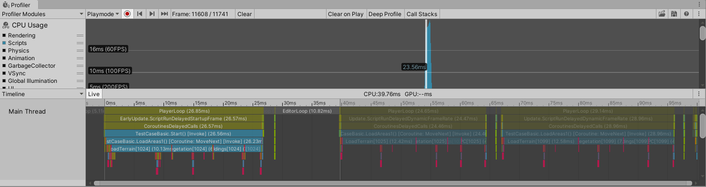
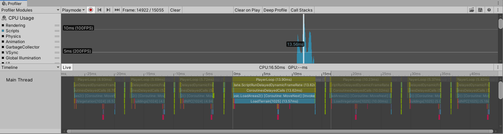

## Easy Time Slicing

EasyTimeSlicing makes it easy to slice heavy tasks into consequent game frames to execute and helps to keep the game running smoothly and avoid janks or spikes.

## Why time slicing

There are often problems that have to execute a large number of tasks in a short period (like in a few frames), which, if not handled properly, can cause junk and reduce the performance of the game.

Here's a common scenario that is to load some areas, including terrain, vegetation, buildings, and NPCs. Now we have the following codes:

```C#
public IEnumerator LoadAreas1(List<int> requestedAera)
{
    foreach (var area in requestedAera)
    {
        AreaInfo info = GetAreaInfo(area);
        LoadTerrain(info);
        LoadVegetation(info);
        LoadBuildings(info);
        LoadNPC(info);
        yield return null;
    }
}
```

Job completed in a few frames, and the profiler shows like this, junk and spikes are obvious:



Now we try to spread the task over more frames:

```C#
public IEnumerator LoadAreas2(List<int> requestedAera)
{
    foreach (var area in requestedAera)
    {
        AreaInfo info = GetAreaInfo(area);
        LoadTerrain(info);
        yield return null;
        LoadVegetation(info);
        yield return null;
        LoadBuildings(info);
        yield return null;
        LoadNPC(info);
        yield return null;
    }
}
```

Now it's getting smooth, but the time per frame may be underused:



Here comes your new choice, EasyTimeSlicing makes it easier to slice a task into separate frames and also make the most of those frames.

```C#
public SliceableTask LoadAreas3(List<int> requestedAera)
{
    List<Action> tasks = new List<Action>();
    foreach (var area in requestedAera)
    {
        AreaInfo info = GetAreaInfo(area);
        tasks.Add(() => LoadTerrain(info));
        tasks.Add(() => LoadVegetation(info));
        tasks.Add(() => LoadBuildings(info));
        tasks.Add(() => LoadNPC(info));
    }

    return new SliceableTask(0.010f, tasks);
}
```

And the diagram:


Another practical application is to reduce the junk caused by object instantiation, by spreading the instantiating tasks over multiple frames while limiting the maximum execution time in one frame.

```c#
private void RunInstantiateTask()
{
    // omitted code...
    new SliceableTask(executionTime, InstantiateItem2);
}

private IEnumerator InstantiateItem2()
{
    // omitted code...
    int index = 0;

    while (index < total)
    {
        if (index < 0 || index >= total)
        {
            yield break;
        }

        // omitted code...
        GameObject go = Instantiate(prefab, this.transform);

        index++;

        yield return null;
    }
}
```


## Installation

Clone this repository and copy it to your project folder, or add `https://github.com/aillieo/EasyTimeSlicing.git#upm` as a dependency in the Package Manager window.

## Quick Start

### Create a sliceable task

### Create an async queue

### Instatiate async

### Load and instatiate asset in a queue

