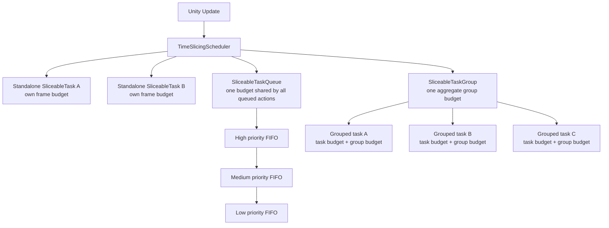

# Easy Time Slicing

English | [简体中文](./README.zh-CN.md)

EasyTimeSlicing spreads synchronous Unity work across frames. It is intended for workloads that can be split into small, indivisible units, such as object instantiation, world streaming, scene construction, or processing a large collection.

The package provides three scheduling models:

- `SliceableTask`: repeatedly executes one callback or a sequence of actions.
- `SliceableTaskQueue`: accepts actions over time and processes them in strict priority order.
- `SliceableTaskGroup`: shares one aggregate frame budget across several `SliceableTask` instances.

All callbacks run on Unity's main thread. EasyTimeSlicing does not make work asynchronous and cannot interrupt a callback after it starts.

## Installation

Add the repository URL to the Unity Package Manager:

```text
https://github.com/aillieo/EasyTimeSlicing.git#upm
```

Alternatively, clone the repository and copy the package contents into your project.

The package currently declares Unity 2019.4 as its minimum version.

## Quick start

```csharp
using AillieoUtils.EasyTimeSlicing;
using UnityEngine;

public class Example : MonoBehaviour
{
    private void Start()
    {
        SliceableTask task = SliceableTask.Start(
            0.002f,
            LoadTerrain,
            LoadVegetation,
            LoadBuildings,
            SpawnNpcs);
    }

    private void LoadTerrain() { }
    private void LoadVegetation() { }
    private void LoadBuildings() { }
    private void SpawnNpcs() { }
}
```

The first argument is a per-frame time budget in seconds. The scheduler executes at least one indivisible unit when the task gets a turn, then continues while its budget remains.

## How the scheduler uses time budgets

The scheduler runs from a persistent `MonoBehaviour` during `Update`. It measures elapsed wall-clock time with `Stopwatch`, not `Time.deltaTime`.

Budgets are soft limits:

- A callback is never interrupted after it starts.
- The scheduler checks elapsed time between callbacks or queue entries.
- A callback that takes longer than the remaining budget can overrun the budget for that frame.
- A budget of `0` is valid and means "execute one indivisible unit when this owner gets a turn."
- There is no package-wide global budget. Independent owners can each consume their own budget in the same frame.


```mermaid
flowchart TB
    U["Unity Update"] --> S["TimeSlicingScheduler"]

    S --> A["Standalone SliceableTask A<br/>own frame budget"]
    S --> B["Standalone SliceableTask B<br/>own frame budget"]
    S --> Q["SliceableTaskQueue<br/>one budget shared by all queued actions"]
    S --> G["SliceableTaskGroup<br/>one aggregate group budget"]

    Q --> QH["High priority FIFO"]
    QH --> QM["Medium priority FIFO"]
    QM --> QL["Low priority FIFO"]

    G --> G1["Grouped task A<br/>task budget + group budget"]
    G --> G2["Grouped task B<br/>task budget + group budget"]
    G --> G3["Grouped task C<br/>task budget + group budget"]
```

| Scheduling model | Budget owner | What shares the budget | Selection order |
| --- | --- | --- | --- |
| Standalone `SliceableTask` | The task | Nothing; every standalone task is independent | Every active standalone task gets a turn each frame |
| `SliceableTaskQueue` | The queue's internal task | All actions in that queue | Strict priority: High, then Medium, then Low; FIFO within a priority |
| `SliceableTaskGroup` | The group | All tasks started through that group | Round-robin across frames |
| Task inside a group | Both the task and its group | The task budget limits that task; the group budget limits the aggregate | Execution stops when either applicable budget is exhausted |

For example, two standalone tasks with 2 ms budgets and one queue with a 3 ms budget can together request roughly 7 ms in a frame. Putting related tasks in a group is the way to impose a shared aggregate limit.

Queues and groups are independent budget owners. A queue cannot be added to a `SliceableTaskGroup`.

## SliceableTask

### Sequence of actions

Use an array, `params` arguments, or any `IEnumerable<Action>`:

```csharp
SliceableTask task = SliceableTask.Start(
    0.003f,
    Step1,
    Step2,
    Step3);

IEnumerable<Action> generatedSteps = BuildSteps();
SliceableTask generatedTask = SliceableTask.Start(0.003f, generatedSteps);
```

Each action is one indivisible unit. Multiple actions can execute in one frame while the task budget remains.

### Closed state machine

Return `true` when all work has completed:

```csharp
var nextChunk = 0;
SliceableTask task = SliceableTask.Start(0.002f, () =>
{
    LoadChunk(nextChunk++);
    return nextChunk >= chunkCount;
});
```

### Open state machine

The scheduler can store an integer state for a stateless callback:

```csharp
bool LoadNextChunk(ref int state)
{
    LoadChunk(state++);
    return state >= chunkCount;
}

SliceableTask task = SliceableTask.Start(0.002f, 0, LoadNextChunk);
```

### Enumerator function

Every `MoveNext()` is treated as one indivisible unit:

```csharp
IEnumerator BuildScene()
{
    BuildTerrain();
    yield return null;

    BuildProps();
    yield return null;

    SpawnActors();
}

SliceableTask task = SliceableTask.Start(0.002f, BuildScene);
```

Yielded values are ignored. This overload uses the enumerator as a state machine; it does not reproduce Unity coroutine yield-instruction semantics such as `WaitForSeconds`.

### Status, exceptions, and cancellation

`SliceableTask` implements `ISliceableTaskHandle`:

```csharp
SliceableTask task = SliceableTask.Start(0.002f, BuildScene);

if (!task.isCompleted)
{
    task.Cancel();
}

switch (task.status)
{
    case SliceableTaskStatus.Pending:
        break;
    case SliceableTaskStatus.Succeeded:
        break;
    case SliceableTaskStatus.Faulted:
        Debug.LogException(task.exception);
        break;
    case SliceableTaskStatus.Cancelled:
        break;
}
```

An exception faults the task and is exposed through `exception`. Enumerator-backed tasks are disposed when they finish, fault, or are removed after cancellation.

## SliceableTaskQueue

A queue is useful when producers need to submit independent actions over time:

```csharp
SliceableTaskQueue queue = SliceableTaskQueue.Create(0.003f);

queue.Enqueue(BuildTerrain, SliceableTaskQueue.Priority.High);
queue.Enqueue(BuildBuildings, SliceableTaskQueue.Priority.Medium);
queue.Enqueue(SpawnAmbientProps, SliceableTaskQueue.Priority.Low);
```

Priority is strict. A continuous stream of High-priority actions can delay Medium- and Low-priority work.

Use a handle when an individual queued action needs observable status or cancellation:

```csharp
SliceableTaskQueue.Handle handle = queue.EnqueueWithHandle(
    SpawnNpc,
    SliceableTaskQueue.Priority.Medium);

handle.Cancel();

Debug.Log(handle.status);      // Cancelled
Debug.Log(handle.isCompleted); // true
```

A cancelled entry is skipped when it reaches the front of its priority queue. Skipping entries is also time-sliced, so cancellation cleanup cannot consume unbounded scheduler time in one callback.

Queue controls and counters:

```csharp
queue.Pause();
queue.Resume();
queue.ClearAll();

int allPending = queue.pendingTasks;
int highPending = queue.GetPendingTasks(SliceableTaskQueue.Priority.High);
bool isRunning = queue.scheduling;
```

`ClearAll()` cancels handles for entries that have not executed.

## SliceableTaskGroup

A group applies one aggregate budget to related tasks while preserving a per-task budget for each member:

```csharp
SliceableTaskGroup streaming = SliceableTaskGroup.Create(
    "WorldStreaming",
    0.004f);

SliceableTask terrain = streaming.Start(
    0.002f,
    new SliceableTaskOptions { profilerTag = "Terrain" },
    LoadNextTerrainChunk);

SliceableTask vegetation = streaming.Start(
    0.001f,
    new SliceableTaskOptions { profilerTag = "Vegetation" },
    LoadNextVegetationChunk);

Debug.Log(streaming.activeTasks);
```

In this example, the scheduler stops giving terrain more callbacks after its own 2 ms budget is exhausted, does the same for vegetation after 1 ms, and stops the group after its 4 ms aggregate budget is exhausted. An individual callback can still overrun any of these soft limits. The scheduler rotates the starting task across frames so that one long-running member does not permanently occupy the first position.

The same action-sequence, state-machine, and enumerator overloads available on `SliceableTask.Start` are available on `SliceableTaskGroup.Start`.

## Diagnostics and profiling

Use `SliceableTaskOptions` to configure Profiler labels and callback-overrun reporting:

```csharp
var options = new SliceableTaskOptions
{
    profilerTag = "World/Vegetation",
    overrunPolicy = SliceOverrunPolicy.Warning,
};

SliceableTask task = SliceableTask.Start(0.001f, options, LoadNextVegetationChunk);
SliceableTaskQueue queue = SliceableTaskQueue.Create(0.002f, options);
```

Profiler samples use these prefixes:

- `EasyTimeSlicing.Scheduler.Update`
- `EasyTimeSlicing.Task/`
- `EasyTimeSlicing.Queue/`
- `EasyTimeSlicing.QueueEntry/`
- `EasyTimeSlicing.Group/`

In the Editor and Development Builds, `SliceOverrunPolicy.Warning` and `SliceOverrunPolicy.Error` report the first callback that exceeds its task budget. Reporting an overrun does not fault the task. Use `Ignore` to disable the report.

## Frame-time helpers

`TimeSlicingUtils` exposes estimates based on the current target, refresh, VSync, and on-demand-rendering configuration:

```csharp
float expectedCost = 0.0005f;
if (TimeSlicingUtils.TryExecute(UpdateOneItem, expectedCost))
{
    // The action was executed.
}
```

Available values include:

- `frameInterval`: estimated seconds per game-loop frame.
- `timeSinceFrameStart`: elapsed time since the current frame began.
- `timeBudgetEstimated`: estimated remaining time in the current frame.

These values are estimates, not execution guarantees.

## Why time slicing

Executing all work immediately can produce visible spikes:


A coroutine that always performs exactly one unit per frame removes the spike but can underuse the available frame time:


EasyTimeSlicing can execute several small units while budget remains:


| Approach | Frames, 3 areas | Longest frame, 3 areas | Frames, 10 areas | Longest frame, 10 areas |
| --- | ---: | ---: | ---: | ---: |
| All area work together | 3 | 23.81 ms | 10 | 27.84 ms |
| One unit every frame | 12 | 12.75 ms | 40 | 12.06 ms |
| EasyTimeSlicing | 7 | 11.92 ms | 21 | 12.55 ms |

Object instantiation is another workload that can be divided into small units:


## Practical guidance

- Split work into callbacks that are much smaller than the desired budget.
- Treat budgets as soft limits because callbacks are non-preemptive.
- Use standalone tasks when their budgets should be independent.
- Use a queue for prioritized, continuously submitted actions.
- Use a group when several tasks must share one aggregate cap.
- Profile on target hardware; callback cost and available frame time vary by platform.
- All public scheduling APIs are intended to be called from Unity's main thread.

## License

MIT. See [LICENSE](./LICENSE).
