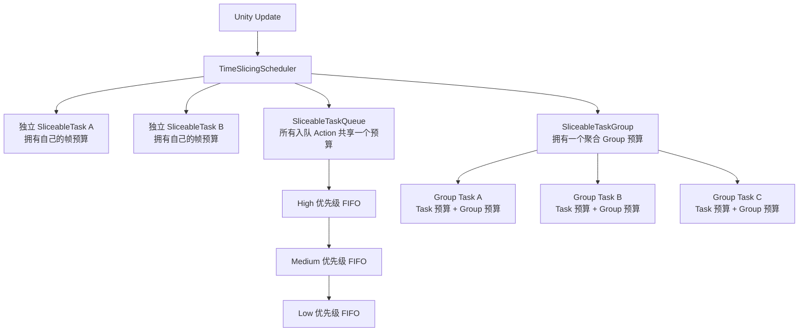
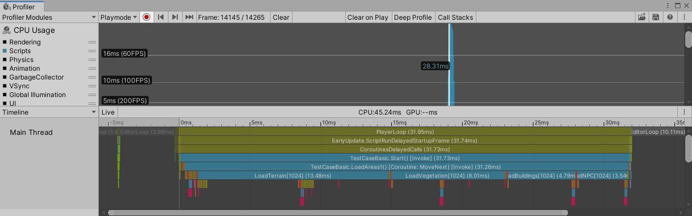
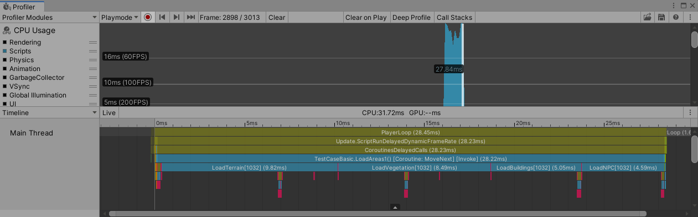
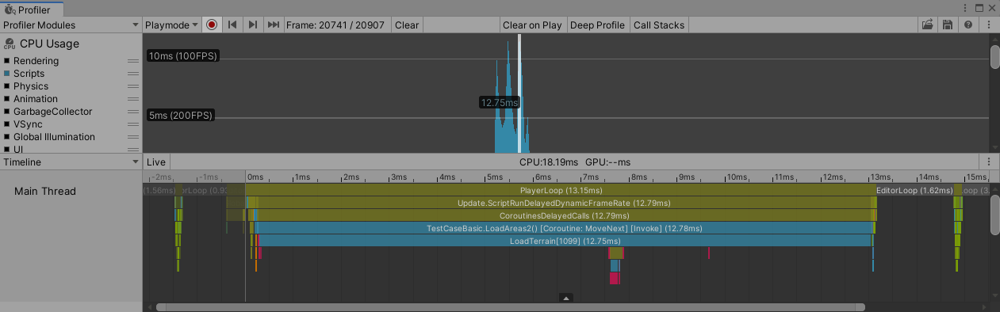
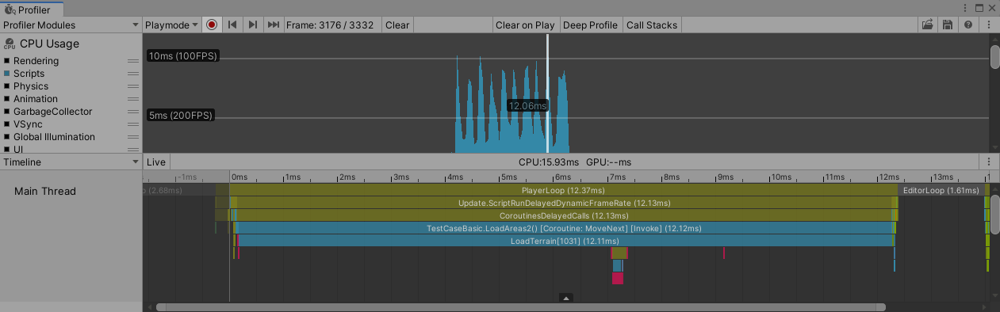
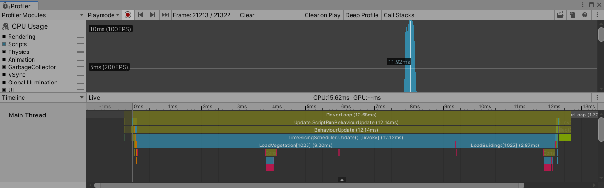
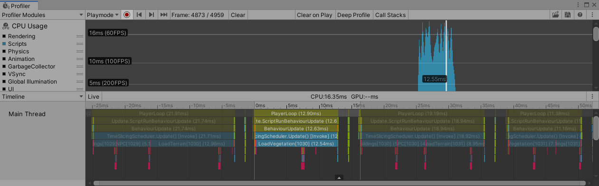

# Easy Time Slicing

[English](./README.md) | 简体中文

EasyTimeSlicing 用于将同步执行的 Unity 工作拆分到多个帧中。它适合能够拆分成多个小型、不可再分执行单元的工作负载，例如对象实例化、世界流式加载、场景构建或大型集合处理。

本包提供三种调度模型：

- `SliceableTask`：重复执行一个回调，或依次执行一组 Action。
- `SliceableTaskQueue`：持续接收 Action，并按照严格的优先级顺序处理。
- `SliceableTaskGroup`：让多个 `SliceableTask` 共享一个聚合帧预算。

所有回调都在 Unity 主线程上运行。EasyTimeSlicing 不会把工作变成异步任务，也无法中断已经开始执行的回调。

## 安装

在 Unity Package Manager 中添加仓库 URL：

```text
https://github.com/aillieo/EasyTimeSlicing.git#upm
```

也可以克隆本仓库，并将包内容复制到你的项目中。

本包当前声明的最低 Unity 版本为 2019.4。

## 快速开始

```csharp
using AillieoUtils.EasyTimeSlicing;
using UnityEngine;

public class Example : MonoBehaviour
{
    private void Start()
    {
        SliceableTask task = SliceableTask.Start(
            0.002f,
            LoadTerrain,
            LoadVegetation,
            LoadBuildings,
            SpawnNpcs);
    }

    private void LoadTerrain() { }
    private void LoadVegetation() { }
    private void LoadBuildings() { }
    private void SpawnNpcs() { }
}
```

第一个参数是以秒为单位的每帧时间预算。任务获得执行机会时，调度器至少会执行一个不可再分的工作单元；如果预算仍有剩余，则继续执行后续单元。

## Scheduler 如何使用时间预算

Scheduler 由一个常驻的 `MonoBehaviour` 在 `Update` 中驱动，并使用 `Stopwatch` 测量实际经过的时间，而不是使用 `Time.deltaTime`。

时间预算是软限制：

- 回调开始后不会被中途打断。
- Scheduler 会在相邻回调或 Queue 条目之间检查已消耗时间。
- 如果单次回调耗时超过剩余预算，本帧就会发生超时。
- `0` 是有效预算，含义是“预算所有者每次获得调度机会时，执行一个不可再分的工作单元”。
- 包内不存在统一的全局预算；彼此独立的预算所有者可以在同一帧分别消耗自己的预算。



| 调度模型 | 预算所有者 | 共享范围 | 选择顺序 |
| --- | --- | --- | --- |
| 独立 `SliceableTask` | Task 本身 | 不共享；每个独立 Task 的预算互不影响 | 每个活跃的独立 Task 每帧都会获得执行机会 |
| `SliceableTaskQueue` | Queue 内部 Task | 同一 Queue 中的所有 Action | 严格按照 High、Medium、Low；相同优先级内为 FIFO |
| `SliceableTaskGroup` | Group | 通过该 Group 启动的所有 Task | 跨帧轮转起始 Task |
| Group 内的 Task | Task 和 Group 共同生效 | Task 预算限制自身；Group 预算限制所有成员的总消耗 | 任意一个适用预算耗尽后都会停止继续执行 |

例如，两个预算分别为 2 ms 的独立 Task，再加上一个预算为 3 ms 的 Queue，在同一帧中可能合计请求约 7 ms。若希望一组相关 Task 受到统一的总预算限制，应将它们放入同一个 Group。

Queue 和 Group 是彼此独立的预算所有者。Queue 不能加入 `SliceableTaskGroup`。

## SliceableTask

### Action 序列

可以传入数组、`params` 参数或任意 `IEnumerable<Action>`：

```csharp
SliceableTask task = SliceableTask.Start(
    0.003f,
    Step1,
    Step2,
    Step3);

IEnumerable<Action> generatedSteps = BuildSteps();
SliceableTask generatedTask = SliceableTask.Start(0.003f, generatedSteps);
```

每个 Action 都是一个不可再分的工作单元。只要 Task 预算仍有剩余，一帧内可以执行多个 Action。

### 闭合状态机

全部工作完成时返回 `true`：

```csharp
var nextChunk = 0;
SliceableTask task = SliceableTask.Start(0.002f, () =>
{
    LoadChunk(nextChunk++);
    return nextChunk >= chunkCount;
});
```

### 开放状态机

Scheduler 可以为无状态回调保存一个整数状态：

```csharp
bool LoadNextChunk(ref int state)
{
    LoadChunk(state++);
    return state >= chunkCount;
}

SliceableTask task = SliceableTask.Start(0.002f, 0, LoadNextChunk);
```

### Enumerator 函数

每次 `MoveNext()` 都被视为一个不可再分的工作单元：

```csharp
IEnumerator BuildScene()
{
    BuildTerrain();
    yield return null;

    BuildProps();
    yield return null;

    SpawnActors();
}

SliceableTask task = SliceableTask.Start(0.002f, BuildScene);
```

Scheduler 会忽略 Enumerator 产生的值。此重载只是把 Enumerator 当作状态机使用，并不会复现 `WaitForSeconds` 等 Unity Coroutine yield instruction 的语义。

### 状态、异常和取消

`SliceableTask` 实现了 `ISliceableTaskHandle`：

```csharp
SliceableTask task = SliceableTask.Start(0.002f, BuildScene);

if (!task.isCompleted)
{
    task.Cancel();
}

switch (task.status)
{
    case SliceableTaskStatus.Pending:
        break;
    case SliceableTaskStatus.Succeeded:
        break;
    case SliceableTaskStatus.Faulted:
        Debug.LogException(task.exception);
        break;
    case SliceableTaskStatus.Cancelled:
        break;
}
```

回调抛出异常后，Task 会进入 Faulted 状态，并通过 `exception` 暴露该异常。基于 Enumerator 的 Task 在成功结束、发生异常或取消后被移出 Scheduler 时会释放 Enumerator。

## SliceableTaskQueue

当工作生产者需要持续提交相互独立的 Action 时，可以使用 Queue：

```csharp
SliceableTaskQueue queue = SliceableTaskQueue.Create(0.003f);

queue.Enqueue(BuildTerrain, SliceableTaskQueue.Priority.High);
queue.Enqueue(BuildBuildings, SliceableTaskQueue.Priority.Medium);
queue.Enqueue(SpawnAmbientProps, SliceableTaskQueue.Priority.Low);
```

优先级是严格的。持续加入 High 优先级 Action 可能导致 Medium 和 Low 优先级工作长期延后。

如果需要观察或取消单个已入队 Action，可以获取 Handle：

```csharp
SliceableTaskQueue.Handle handle = queue.EnqueueWithHandle(
    SpawnNpc,
    SliceableTaskQueue.Priority.Medium);

handle.Cancel();

Debug.Log(handle.status);      // Cancelled
Debug.Log(handle.isCompleted); // true
```

取消后的条目会在到达对应优先级队列头部时被跳过。跳过过程同样受时间切片约束，因此清理取消项不会在单次 Scheduler 回调中消耗无限制的时间。

Queue 控制和计数接口：

```csharp
queue.Pause();
queue.Resume();
queue.ClearAll();

int allPending = queue.pendingTasks;
int highPending = queue.GetPendingTasks(SliceableTaskQueue.Priority.High);
bool isRunning = queue.scheduling;
```

`ClearAll()` 会取消所有尚未执行条目的 Handle。

## SliceableTaskGroup

Group 为多个相关 Task 提供一个聚合预算，同时保留每个成员自己的 Task 预算：

```csharp
SliceableTaskGroup streaming = SliceableTaskGroup.Create(
    "WorldStreaming",
    0.004f);

SliceableTask terrain = streaming.Start(
    0.002f,
    new SliceableTaskOptions { profilerTag = "Terrain" },
    LoadNextTerrainChunk);

SliceableTask vegetation = streaming.Start(
    0.001f,
    new SliceableTaskOptions { profilerTag = "Vegetation" },
    LoadNextVegetationChunk);

Debug.Log(streaming.activeTasks);
```

在这个例子中，Terrain 自身的 2 ms 预算耗尽后，Scheduler 不再继续调用它；Vegetation 的 1 ms 预算同理；Group 的聚合消耗达到 4 ms 后，整个 Group 停止继续执行。单个回调仍然可能超过这些软限制。Scheduler 会跨帧轮换起始 Task，避免某个长时间运行的成员永久占据第一个位置。

`SliceableTask.Start` 支持的 Action 序列、状态机和 Enumerator 重载，也都可以通过 `SliceableTaskGroup.Start` 使用。

## 诊断和性能分析

使用 `SliceableTaskOptions` 配置 Profiler 标签和回调超时报告：

```csharp
var options = new SliceableTaskOptions
{
    profilerTag = "World/Vegetation",
    overrunPolicy = SliceOverrunPolicy.Warning,
};

SliceableTask task = SliceableTask.Start(0.001f, options, LoadNextVegetationChunk);
SliceableTaskQueue queue = SliceableTaskQueue.Create(0.002f, options);
```

Profiler Sample 使用以下前缀：

- `EasyTimeSlicing.Scheduler.Update`
- `EasyTimeSlicing.Task/`
- `EasyTimeSlicing.Queue/`
- `EasyTimeSlicing.QueueEntry/`
- `EasyTimeSlicing.Group/`

在 Editor 和 Development Build 中，`SliceOverrunPolicy.Warning` 和 `SliceOverrunPolicy.Error` 会报告第一次超过 Task 预算的回调。超时报告不会令 Task 进入 Faulted 状态。使用 `Ignore` 可以关闭报告。

## 帧时间辅助接口

`TimeSlicingUtils` 会根据当前目标帧率、刷新率、VSync 和 On-Demand Rendering 配置提供估算值：

```csharp
float expectedCost = 0.0005f;
if (TimeSlicingUtils.TryExecute(UpdateOneItem, expectedCost))
{
    // Action 已执行。
}
```

可用属性包括：

- `frameInterval`：估算的游戏循环帧间隔秒数。
- `timeSinceFrameStart`：当前帧开始后已经过的时间。
- `timeBudgetEstimated`：当前帧估算的剩余时间。

这些值只是估算，而不是执行保证。

## 为什么需要时间切片

立即执行全部工作可能产生明显的帧耗时尖峰：





始终每帧只执行一个单元的 Coroutine 可以消除尖峰，但可能无法充分利用可用帧时间：





EasyTimeSlicing 可以在预算剩余时执行多个小型工作单元：





| 方案 | 3 个区域帧数 | 3 个区域最长帧 | 10 个区域帧数 | 10 个区域最长帧 |
| --- | ---: | ---: | ---: | ---: |
| 每个区域的工作集中执行 | 3 | 23.81 ms | 10 | 27.84 ms |
| 每帧执行一个工作单元 | 12 | 12.75 ms | 40 | 12.06 ms |
| EasyTimeSlicing | 7 | 11.92 ms | 21 | 12.55 ms |

对象实例化也是一种适合拆分成小型工作单元的负载：


## 实践建议

- 将工作拆分成远小于目标预算的回调。
- 回调不可抢占，因此应把预算视为软限制。
- 当不同 Task 应拥有独立预算时，使用独立 Task。
- 对持续提交且需要优先级的 Action 使用 Queue。
- 当多个 Task 必须共享一个聚合上限时，使用 Group。
- 在目标硬件上进行性能分析；回调成本和可用帧时间会随平台变化。
- 所有公开调度 API 都应从 Unity 主线程调用。

## 许可证

MIT，详见 [LICENSE](./LICENSE)。
